# Distributed Rate Limiter

> A production-inspired distributed rate limiting system built using **Java**, **Spring Boot**, **Redis Lua scripting**, **Docker**, **NGINX**, and **k6**.

The project demonstrates how modern backend systems implement scalable, consistent, and resilient request throttling across both **single-node** and **distributed deployments** while maintaining correctness under concurrent workloads.

It combines multiple rate limiting algorithms, Redis-backed distributed state management, resilience patterns, automated benchmarking, comprehensive testing, and production-oriented software design into a single end-to-end implementation.

---

<p align="center">


</p>

---

# Highlights

*  Three production-inspired rate limiting algorithms
*  Redis + Lua scripting for atomic distributed state updates
*  Single-node and distributed deployment modes
*  Circuit Breaker with configurable Fail Open / Fail Closed strategies
*  Automated k6 benchmarking framework
*  Performance report and graph generation
*  Unit, integration, Redis, and concurrency testing
*  Fully containerized deployment using Docker Compose

---

# Why This Project?

Modern APIs must protect themselves from abusive traffic, sudden request spikes, and resource exhaustion without negatively impacting legitimate users.

While implementing an in-memory rate limiter is relatively straightforward, building one that functions correctly across multiple application instances introduces several engineering challenges.

These include:

* Maintaining globally shared request quotas
* Preventing race conditions during concurrent updates
* Performing atomic operations on distributed state
* Scaling horizontally without sacrificing correctness
* Remaining resilient during infrastructure failures
* Understanding the performance cost of distributed coordination

This project explores those challenges by implementing a production-inspired distributed rate limiting system backed by **Redis Lua scripting** and validating its behaviour using an automated benchmarking framework.

Rather than focusing only on rate limiting algorithms, the project demonstrates how they integrate into a complete backend system featuring:

* HTTP request interception
* Runtime algorithm selection
* Distributed state management
* Resilience patterns
* Infrastructure automation
* Performance benchmarking
* Observability
* Automated testing

---

# Architecture Overview

The application is designed using a modular architecture that separates HTTP processing, policy resolution, algorithm execution, resilience mechanisms, and distributed state management.

This separation allows each subsystem to evolve independently while maintaining a consistent programming model.

```text
                          Client Request
                                 │
                                 ▼
                     +-----------------------+
                     |   RateLimitFilter     |
                     +-----------------------+
                                 │
                                 ▼
                     +-----------------------+
                     |   RateLimitPolicy     |
                     +-----------------------+
                                 │
                                 ▼
                     +-----------------------+
                     | RateLimiterRegistry   |
                     +-----------------------+
                                 │
           ┌─────────────────────┼─────────────────────┐
           │                     │                     │
           ▼                     ▼                     ▼
     Token Bucket       Sliding Window        Fixed Window
           │                     │                     │
           └─────────────────────┼─────────────────────┘
                                 ▼
                     +-----------------------+
                     |  Circuit Breaker      |
                     +-----------------------+
                                 │
                                 ▼
                     +-----------------------+
                     | Redis Lua Execution   |
                     +-----------------------+
                                 │
                                 ▼
                               Redis
                                 │
                                 ▼
                          HTTP Response
```

The architecture intentionally follows the principle of **separation of concerns**, allowing algorithms, storage implementations, resilience mechanisms, and request processing components to remain loosely coupled and independently testable.

---

# Deployment Modes

The project supports two deployment models, allowing direct comparison between a baseline implementation and a horizontally scalable distributed architecture.

## Single-Node Deployment

The single-node deployment is intended for:

* Local development
* Functional validation
* Algorithm verification
* Baseline performance benchmarking

All requests are processed by a single Spring Boot application while Redis stores the shared rate limiting state.

```text
                    Client
                       │
                       ▼
              Spring Boot Application
                       │
                       ▼
                Rate Limiter Core
                       │
                       ▼
                  Redis + Lua
```

## Distributed Deployment

The distributed deployment demonstrates globally consistent rate limiting across multiple application instances.

Incoming requests are distributed by **NGINX**, while every instance shares the same Redis backend. This guarantees consistent request quotas regardless of which application instance handles the request.

```text
                           Client
                              │
                              ▼
                     +----------------+
                     |     NGINX      |
                     +----------------+
                     /       │        \
                    /        │         \
                   ▼         ▼          ▼

             +---------+ +---------+ +---------+
             | App-1   | | App-2   | | App-3   |
             +---------+ +---------+ +---------+
                    \        │        /
                     \       │       /
                      \      │      /
                           Redis
                         (Lua Scripts)
```

# Supported Algorithms

The project currently implements three production-inspired rate limiting algorithms.

| Algorithm                  | Description                                                        | Time Complexity | Distributed | Atomic |
| -------------------------- | ------------------------------------------------------------------ | --------------: | :---------: | :----: |
| **Token Bucket**           | Allows configurable bursts while maintaining a steady refill rate. |            O(1) |      ✅      |    ✅   |
| **Sliding Window Counter** | Smooths traffic by approximating a sliding time window.            |            O(1) |      ✅      |    ✅   |
| **Fixed Window**           | Simple counter-based algorithm using fixed time windows.           |            O(1) |      ✅      |    ✅   |

Every algorithm implements the same `RateLimiter` interface, allowing runtime selection without changing application code.

This makes it straightforward to add additional algorithms while preserving the existing infrastructure.

---

# Request Processing Flow

Every incoming request follows the same processing pipeline regardless of the selected algorithm.

```text
                         HTTP Request
                               │
                               ▼
                     RateLimitFilter
                               │
                               ▼
                     RateLimitPolicy
                               │
                               ▼
                      Client Key Extraction
                               │
                               ▼
                    RateLimiterRegistry
                               │
                               ▼
                  Selected Rate Limiter
                               │
                               ▼
                      Circuit Breaker
                               │
                               ▼
                      Redis Lua Script
                               │
                               ▼
                           Redis Server
                               │
                               ▼
                        RateLimitResult
                               │
                               ▼
                        HTTP Response
```

When a request is allowed, the response contains standard rate limiting headers including:

* Configured request limit
* Remaining quota
* Selected algorithm
* Retry information (when applicable)

Rejected requests return **HTTP 429 (Too Many Requests)** together with a `Retry-After` header.

---

# Repository Structure

The repository is organized to separate application code, benchmark automation, deployment configuration, and documentation.

```text
distributed-rate-limiter
│
├── src/                     # Application source code
│
├── benchmark/               # Automated benchmark framework
│   ├── automation/
│   ├── graphs/
│   ├── reports/
│   ├── results/
│   ├── scenarios/
│   └── README.md
│
├── docs/                    # Technical documentation
│   ├── benchmark/
│   └── README.md
│
├── docker/                  # Docker Compose & NGINX configuration
│
├── Dockerfile
├── pom.xml
```

---

# Quick Start

## Prerequisites

Before running the project, ensure the following software is installed:

* Java 17
* Maven 3.9+
* Docker
* Docker Compose
* Python 3 (for graph generation)
* k6 (for benchmarking)

---

## Clone the Repository

```bash
git clone https://github.com/<your-username>/distributed-rate-limiter.git

cd distributed-rate-limiter
```

---

## Build the Project

Compile the application and execute the complete test suite.

```bash
mvn clean install
```

---

## Run Unit Tests

```bash
mvn test
```

---

## Start the Single-Node Deployment

```bash
docker compose \
    -f docker/docker-compose.single-node.yml \
    up --build
```

---

## Start the Distributed Deployment

```bash
docker compose \
    -f docker/docker-compose.distributed.yml \
    up --build
```

---

## Execute Benchmarks

### Single Node

```powershell
benchmark/automation/single-node/run-all.ps1
```

### Distributed

```powershell
benchmark/automation/distributed/run-all.ps1
```

The benchmark framework automatically performs:

* Environment validation
* Warm-up execution
* Infrastructure benchmarks
* Behavioural benchmarks
* Docker metrics collection
* Redis metrics collection
* Spring Boot metrics collection
* Benchmark report generation
* Performance graph generation

---

# Benchmark Highlights

Performance benchmarking is a first-class component of this project. Rather than relying solely on theoretical complexity, the implementation is validated under concurrent workloads using an automated benchmarking framework built with **k6**, **Docker**, **Redis**, and **Spring Boot Actuator**.

The benchmark suite compares **single-node** and **distributed** deployments while collecting application, infrastructure, and Redis metrics.

---

## Infrastructure Benchmark

The following results represent the **average of repeated benchmark executions**.

### Throughput & Tail Latency

| Concurrent VUs | Single Node (Req/s) | Distributed (Req/s) | Single P95 (ms) | Distributed P95 (ms) |
|---------------:|--------------------:|--------------------:|----------------:|---------------------:|
| 5 | 2546.64 | 2155.42 | 3.21 | 3.08 |
| 10 | 3991.08 | 3151.82 | 3.36 | 4.07 |
| 25 | 5909.17 | 4509.06 | 6.15 | 8.25 |
| 50 | 6130.25 | 4738.67 | 13.03 | 17.02 |
| 100 | 6025.64 | 5165.38 | 28.75 | 29.74 |

---

### Average Request Latency

| Concurrent VUs | Single Node Avg (ms) | Distributed Avg (ms) |
|---------------:|---------------------:|---------------------:|
| 5 | 1.85 | 2.20 |
| 10 | 2.36 | 3.01 |
| 25 | 4.03 | 5.45 |
| 50 | 7.95 | 10.45 |
| 100 | 16.38 | 19.11 |

---

## Key Findings

- **Single-node** consistently achieves **14–24% higher throughput** due to the absence of distributed coordination overhead.
- **Distributed deployment** scales predictably while maintaining globally consistent request quotas across multiple application instances.
- Additional latency is primarily introduced by **Redis communication**, **NGINX load balancing**, and **distributed state synchronization**.
- **P95 latency remains below 30 ms** for both deployments even at **100 concurrent virtual users**.
- All benchmark executions completed successfully while maintaining **correct rate limiting behaviour** and **cross-instance consistency**.

---

# Performance Graphs

## Throughput Comparison

<p align="center">
  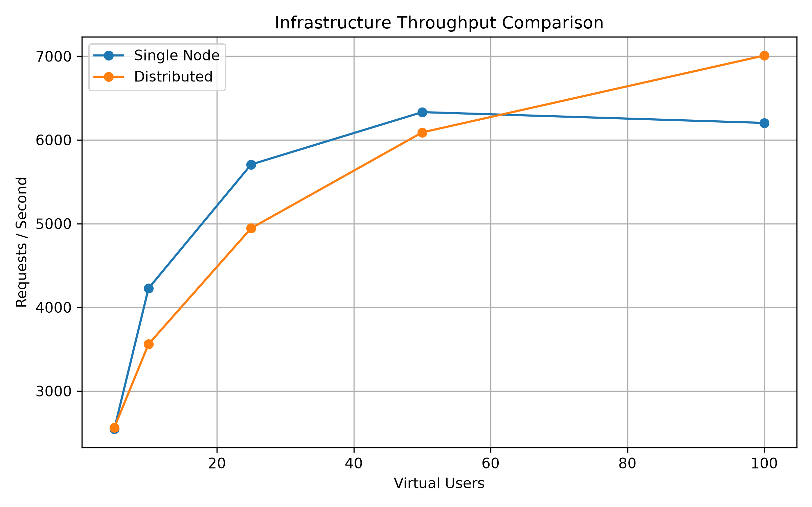
</p>

---

## Average Latency Comparison

<p align="center">
  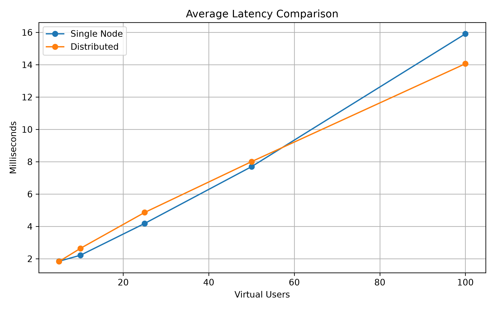
</p>

---

## P95 Latency Comparison

<p align="center">
  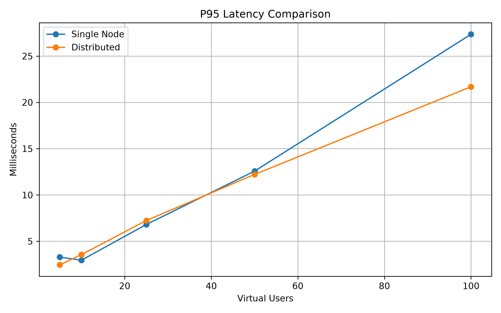
</p>

> **Note:** The comparison graphs above summarize the benchmark results across both deployment modes. Individual deployment graphs are available below.

---

<details>

<summary><b> Single-Node Benchmark Graphs</b></summary>

### Throughput vs Concurrent Users

<p align="center">
  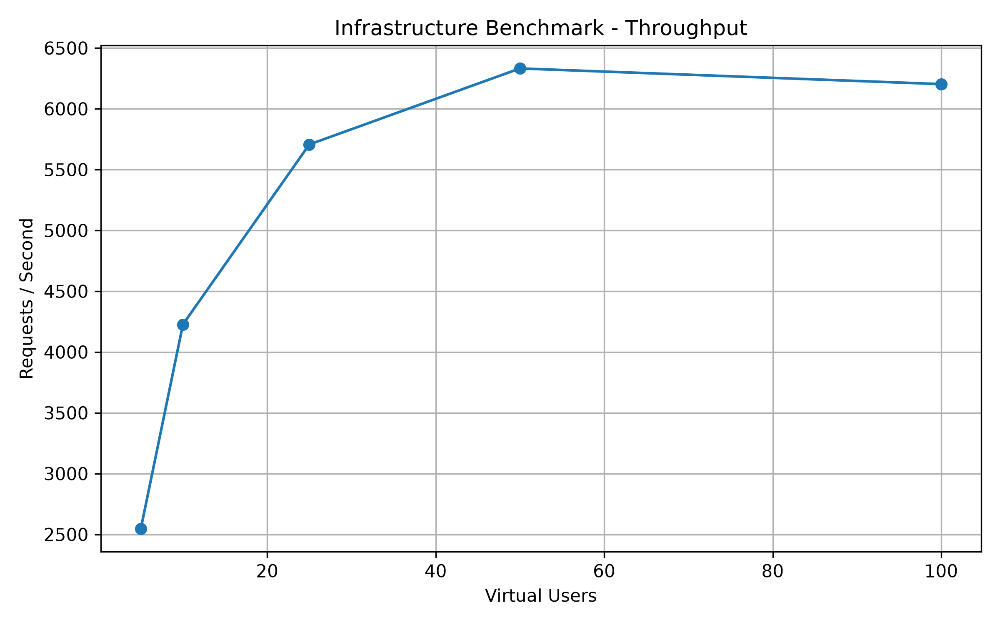
</p>

---

### Average Latency vs Concurrent Users

<p align="center">
  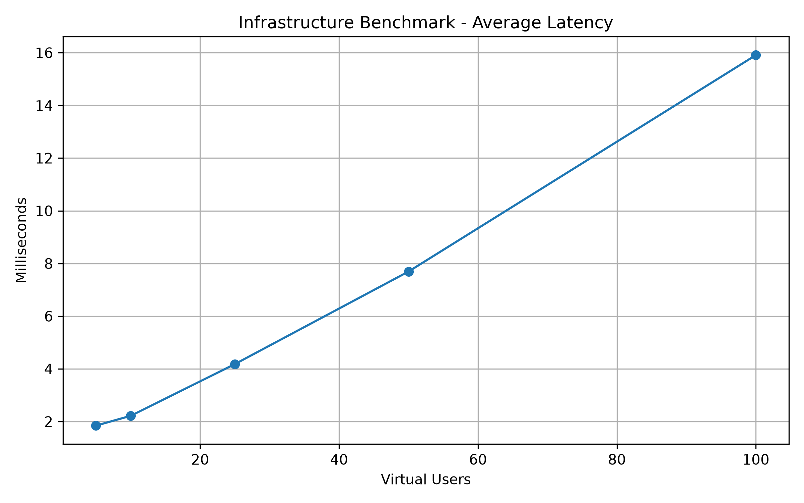
</p>

---

### P95 Latency vs Concurrent Users

<p align="center">
  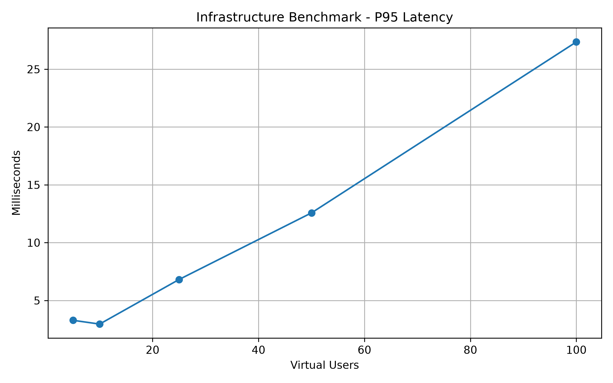
</p>

---

### Scaling Efficiency

<p align="center">
  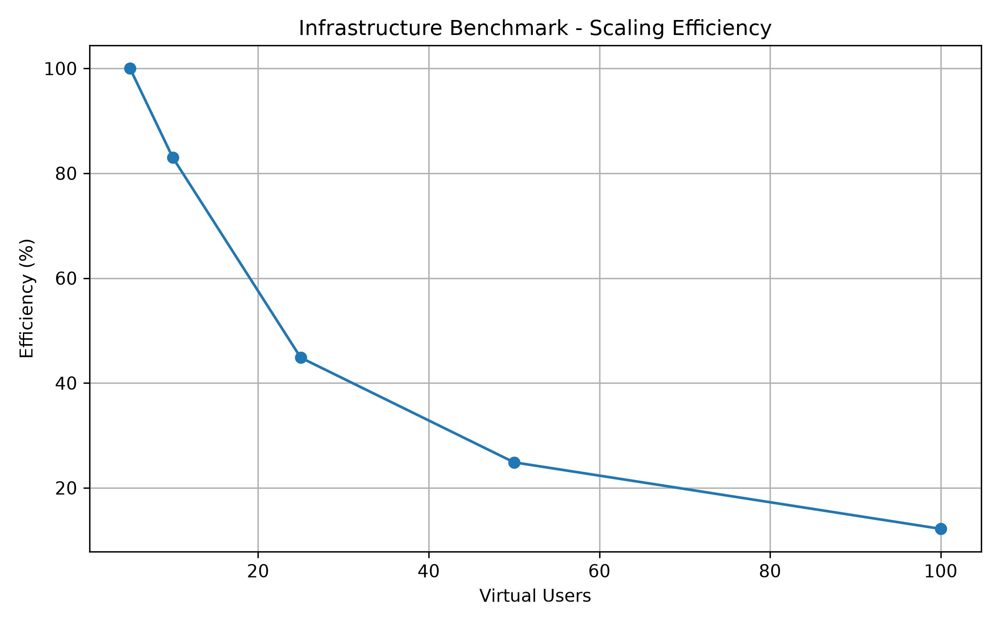
</p>

---

### Failure Rate

<p align="center">
  
</p>

</details>

---

<details>

<summary><b> Distributed Benchmark Graphs</b></summary>

### Throughput vs Concurrent Users

<p align="center">
  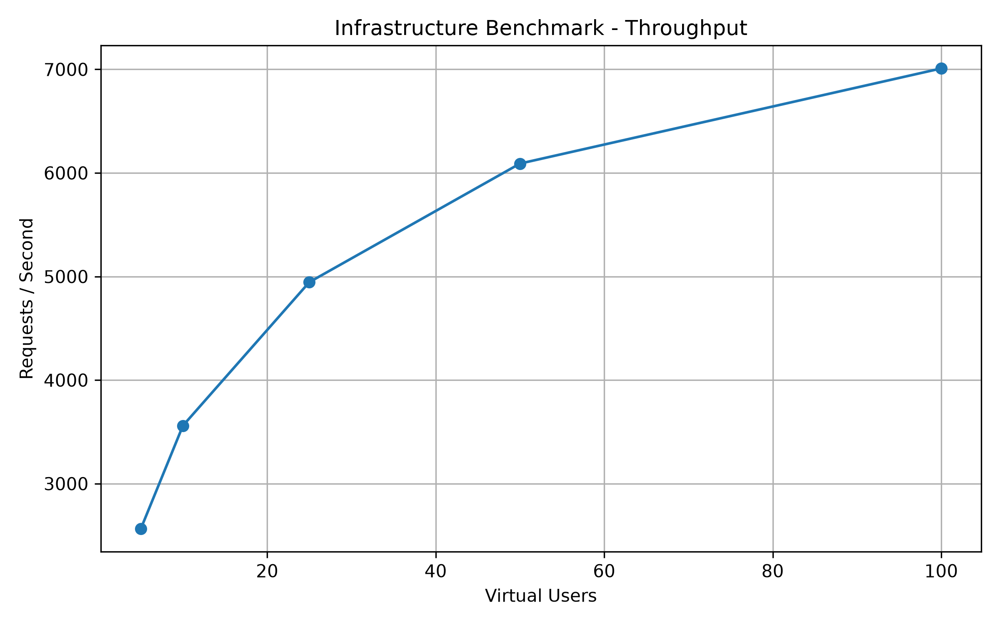
</p>

---

### Average Latency vs Concurrent Users

<p align="center">
  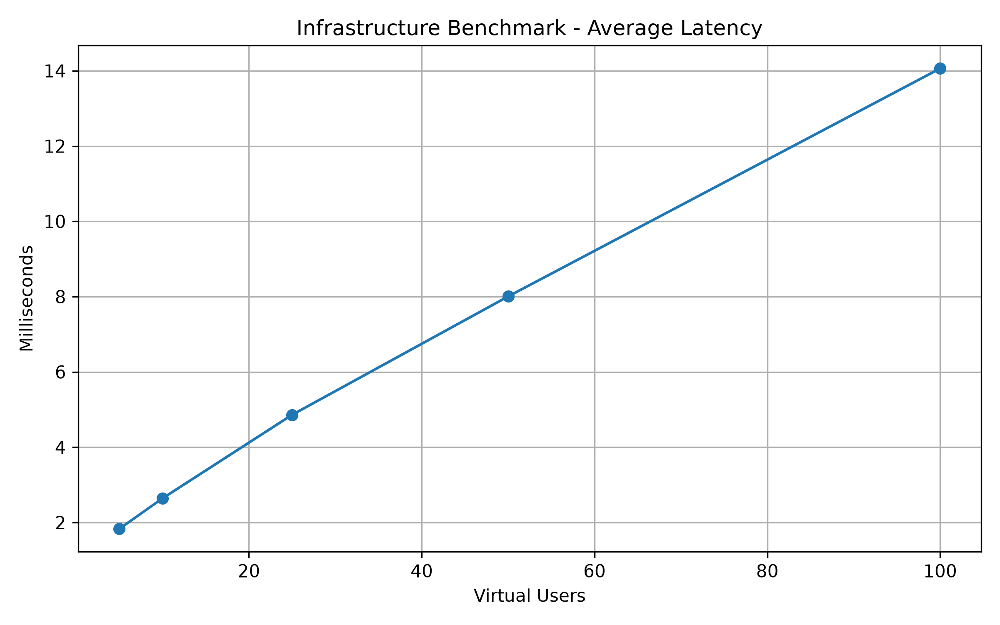
</p>

---

### P95 Latency vs Concurrent Users

<p align="center">
  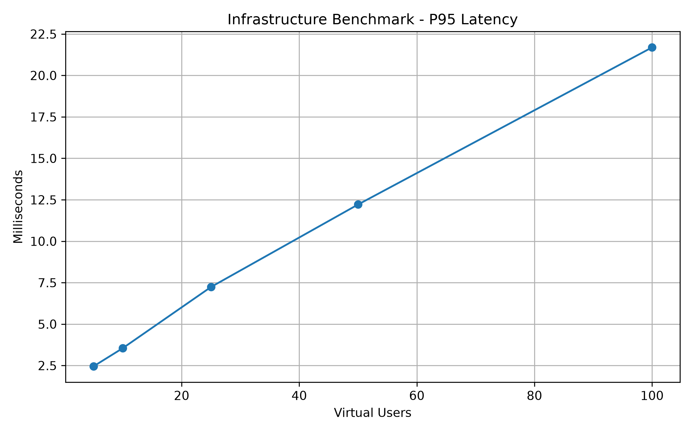
</p>

---

### Scaling Efficiency

<p align="center">
  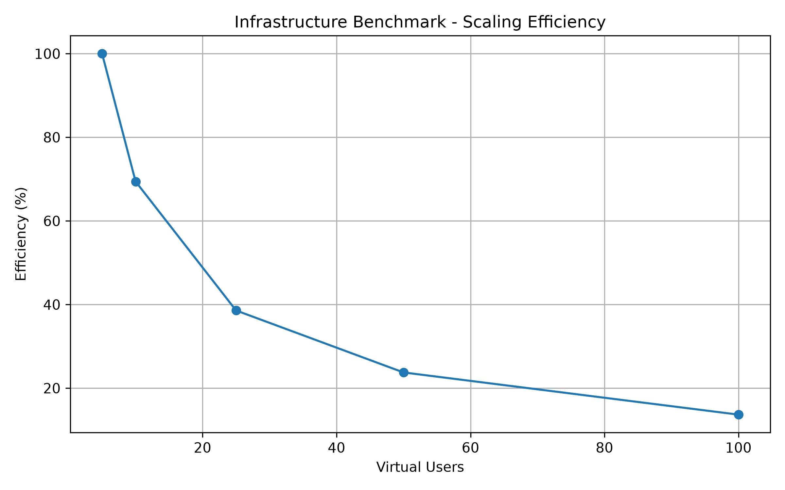
</p>

---

### Failure Rate

<p align="center">
  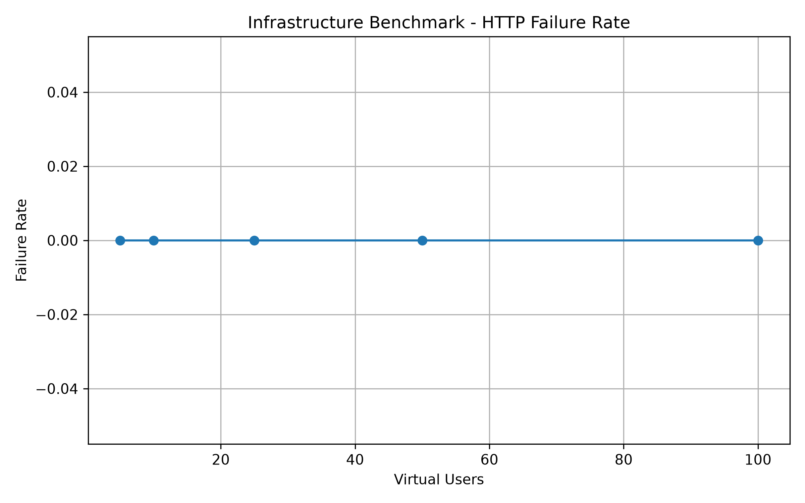
</p>

</details>

---

## Benchmark Framework

The automated benchmarking framework provides:

- Infrastructure benchmarking
- Behavioural benchmarking
- Automated deployment orchestration
- Warm-up execution
- Continuous Docker metrics collection
- Spring Boot metrics collection
- Redis metrics collection
- Automated report generation
- Performance graph generation
- Repeatable benchmark execution

For additional benchmark methodology and analysis, see the documentation under **`docs/benchmark/`**.

---

# Testing

The project contains a comprehensive automated test suite covering correctness, resilience, and distributed behaviour.

### Test Coverage

* Unit Tests
* Integration Tests
* Redis Lua Tests
* Spring Boot Tests
* Testcontainers Integration
* Circuit Breaker Tests
* Concurrency Validation
* Distributed Behaviour Verification

Execute the complete suite using:

```bash
mvn clean test
```

---

# Technology Stack

| Category            | Technology                       |
| ------------------- | -------------------------------- |
| Language            | Java 17                          |
| Framework           | Spring Boot                      |
| Distributed Storage | Redis                            |
| Atomic Execution    | Lua Scripting                    |
| Build Tool          | Maven                            |
| Containerization    | Docker                           |
| Orchestration       | Docker Compose                   |
| Load Balancer       | NGINX                            |
| Benchmarking        | k6                               |
| Metrics             | Micrometer                       |
| Monitoring          | Spring Boot Actuator             |
| Testing             | JUnit 5, Mockito, Testcontainers |

---

# Documentation

The root README provides a high-level overview of the project.

More detailed technical documentation is available throughout the repository.

| Location              | Description                                                  |
| --------------------- | ------------------------------------------------------------ |
| `docs/README.md`      | Documentation index                                          |
| `docs/benchmark/`     | Benchmark environment, methodology, validation, and analysis |
| `benchmark/README.md` | Benchmark automation framework                               |
| `benchmark/reports/`  | Generated benchmark reports                                  |
| `benchmark/results/`  | Raw benchmark data                                           |
| `benchmark/graphs/`   | Generated benchmark graphs                                   |

---

# Future Work

Potential future enhancements include:

* Redis Cluster support
* Adaptive rate limiting
* Dynamic rule reloading
* OpenTelemetry integration
* Grafana dashboards

If you found this repository useful, consider giving it a ⭐.
